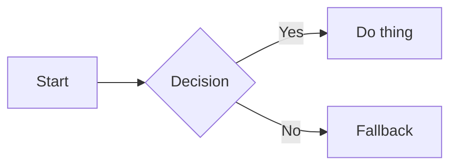
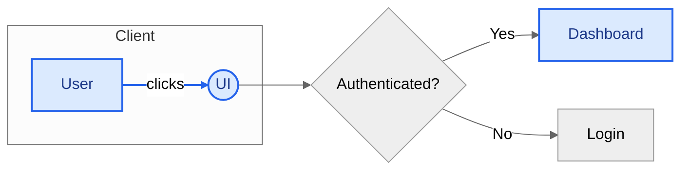
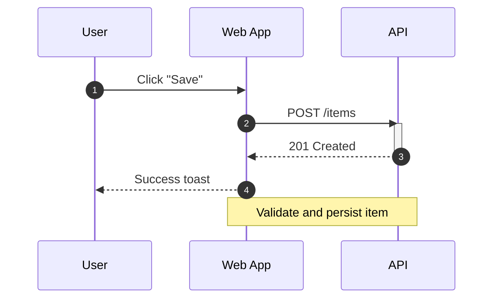
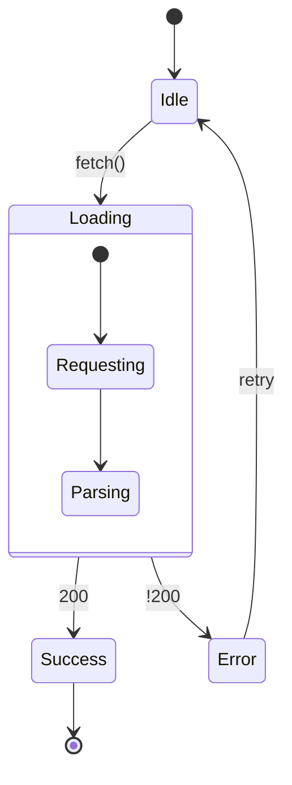
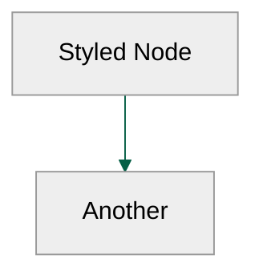
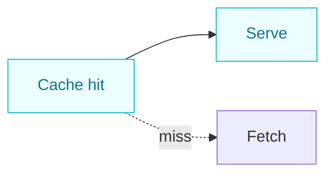

# Repository Guidelines

## Project Structure & Module Organization

- Root config: `docusaurus.config.ts`, `sidebars.ts`, `package.json`, `bun.lock`.
- Content: `docs/` (documentation), `static/` (assets served as-is).
- UI/pages: `src/pages/` (React/TSX pages), `src/css/` (custom styles).
- Build output: `.docusaurus/` (cache) and `build/` (static site after build).

## Build, Test, and Development Commands

- Install: `bun install` — install dependencies (Node ≥ 18 required).
- Dev server: `bun run start` — hot-reload at `http://localhost:3000`.
- Build: `bun run build` — generate static site into `build/`.
- Preview: `bun run serve` — serve the `build/` output locally.
- Clean cache: `bun run clear` — clear Docusaurus cache and artifacts.
- Typecheck: `bun run typecheck` — run TypeScript type checks.
- Deploy (GH Pages): `USE_SSH=true bun run deploy` or `GIT_USER=<username> bun run deploy`.

## Coding Style & Naming Conventions

- TypeScript/React with 2-space indentation; keep imports sorted logically.
- Components: PascalCase (e.g., `MyComponent.tsx`). Docs files: kebab-case (e.g., `getting-started.md`).
- Prefer MDX for rich content; keep headings hierarchical and concise.
- Links: use relative links within `docs/`; place images in `static/img/`.

## Testing Guidelines

- No formal test suite. Validate by building and serving: `bun run build && bun run serve`.
- Check for broken links and missing assets during review; ensure sidebar entries resolve.
- Keep PRs small and scoped; include steps to reproduce and screenshots for UI changes.

## Commit & Pull Request Guidelines

- Commits: prefer Conventional Commits (e.g., `docs: add intro page`, `feat: hero section`).
- PRs: include a clear description, linked issues, and any visual diffs/screenshots.
- Keep diffs minimal; avoid mass formatting changes unrelated to the change.
- Verify `bun run build` passes before requesting review.

## Security & Configuration Tips

- Never commit secrets. Configure deploy creds via environment variables (`USE_SSH`, `GIT_USER`).
- External scripts/styles should be pinned and reviewed before inclusion.

## Mermaid.js Structure & Styling

- Enablement: Docusaurus is configured for Mermaid (`markdown.mermaid: true`, theme `@docusaurus/theme-mermaid`). Use fenced code blocks with the language set to `mermaid`.
- Scope: Prefer small, focused diagrams. Split complex flows into sections and add captions explaining intent and key paths.
- IDs & labels: Use short alphanumeric IDs (no spaces); wrap long labels in quotes: `A["Long label"]`.
- Direction: Choose `LR` (left→right) for process flows, `TD` (top→down) for hierarchies, and keep orientation consistent across the docs.
- Styling: Use `classDef` + `class` for reusable styles, `style` for one‑off node tweaks, and `linkStyle` for edge styling. For per‑diagram theming, use the `init` directive.

### Quick Usage

### Flowcharts

- Keywords: `flowchart TD|LR`, nodes (`A[rect]`, `B((circle))`, `C{{diamond}}`), edges (`A --> B`, `A -- label --> B`).
- Grouping: `subgraph Name ... end` to visually cluster related steps.
- Labels: Use `-- text -->` on edges; keep action‑oriented and concise.
- Example with subgraph, labels, and classes:

### Sequence Diagrams

- Keywords: `sequenceDiagram`, `participant`, messages (`->>`, `-->>`), `activate`/`deactivate`, `Note`, `alt/else`, `opt`, `par`, `autonumber`.
- Use for request/response flows, async steps, and error branches.
- Example:

### State Diagrams

- Keywords: `stateDiagram-v2`, initial/final: `[*]`, transitions: `A --> B: event`, composite states via `state X { ... }`.
- Use for component lifecycles, auth/session states, and background jobs.
- Example:

### Styling & Theming

- Per‑diagram theme: place at the top of the block.

- Reusable classes: declare once per diagram and apply via `class`.

- One‑off styling: `style Id fill:#fff7ed,stroke:#c2410c,color:#7c2d12,stroke-width:2px;`
- Edge styling: `linkStyle idx stroke:#0ea5e9,stroke-width:2px,stroke-dasharray: 3 3;`
- Direction: choose `LR` or `TD` based on readability and available width.

### Authoring Tips

- Keep diagrams readable: limit nodes/edges per diagram; prefer subgraphs over dense meshes.
- Prefer verbs in edge labels ("validate", "redirect").
- Align diagram semantics with text: add a one‑line caption before/after the diagram.
- Test in dev: `bun run start` renders Mermaid; adjust sizes and labels until legible.
- Use   instead of \n for line breaks in labels.

### Common Pitfalls

- Spaces in IDs can break styling/class application—use `A_B` or `A-B` and quote labels instead.
- Very long labels wrap unpredictably—prefer shorter labels or line breaks (` ` in labels).
- Mixed orientations across a page harm scanability—standardize on `LR` or `TD` per section.