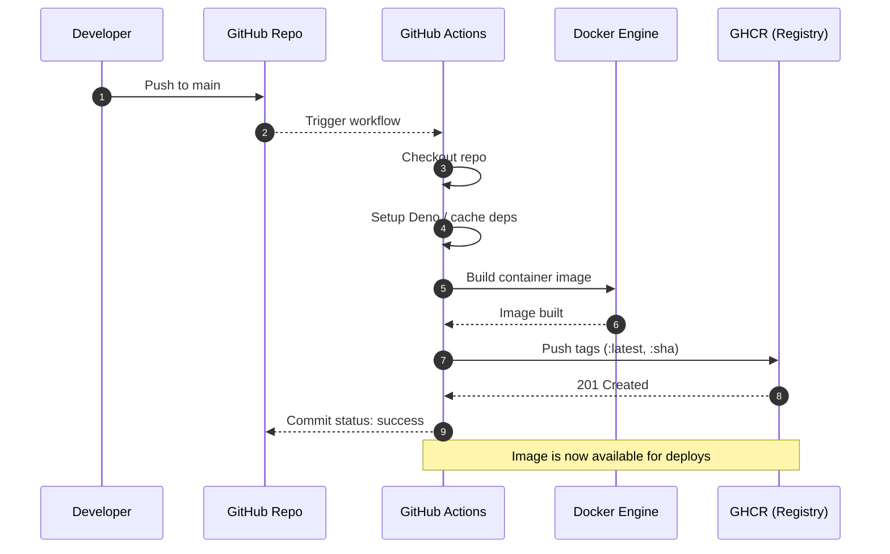
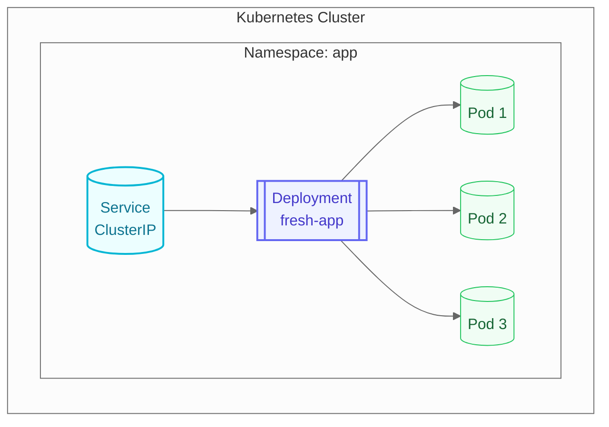

# Introduction

Get started with [Deno Fresh](https://fresh.deno.dev/).

This template comes with:

1. A working [Deno Fresh](https://fresh.deno.dev/) application
2. [Docker build](https://docs.deno.com/runtime/reference/docker/) and
   [push to Github Container Registry](https://github.com/wcygan/deno-fresh-template/blob/main/.github/workflows/build-and-push-to-ghcr.yml)
3. [Kubernetes](https://kubernetes.io/) Deploy
4. Documentation with [Docusaurus](https://docusaurus.io/) (and
   [Mermaid support](https://docusaurus.io/docs/next/markdown-features/diagrams))
   and
   [GitHub Pages Deployment](https://github.com/wcygan/deno-fresh-template/blob/main/.github/workflows/deploy-github-pages.yml)

## Docker Build & Push to GitHub Container Registry

> [See the Images pushed to Github Container Registry](https://github.com/wcygan/deno-fresh-template/pkgs/container/deno-fresh-template%2Ffrontend)

The following sequence shows a push to `main` triggering a build and push to
GHCR.

## Kubernetes Deploy

We can deploy
[the container](https://github.com/wcygan/deno-fresh-template/pkgs/container/deno-fresh-template%2Ffrontend)
into a Kubernetes cluster.

For example, we can use a `Service` that targets a `Deployment` managing 3 Pods
inside the cluster:

