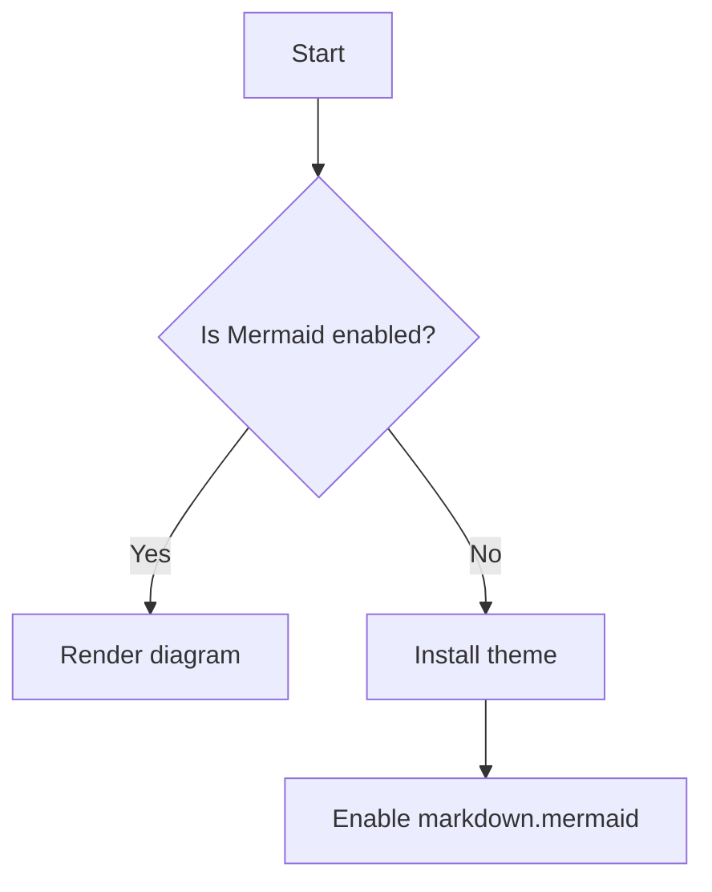

# Introduction

Get started with [Deno Fresh](https://fresh.deno.dev/). 

This template comes with:

1. A working [Deno Fresh](https://fresh.deno.dev/) application
2. [Docker build](https://docs.deno.com/runtime/reference/docker/) and [push to Github Container Registry](https://github.com/wcygan/deno-fresh-template/blob/main/.github/workflows/build-and-push-to-ghcr.yml)
3. [Kubernetes](https://kubernetes.io/) Deploy
4. Documentation with [Docusaurus](https://docusaurus.io/) (and [Mermaid support](https://docusaurus.io/docs/next/markdown-features/diagrams)) and [GitHub Pages Deployment](https://github.com/wcygan/deno-fresh-template/blob/main/.github/workflows/deploy-github-pages.yml)

## Diagrams

You can embed Mermaid diagrams directly in Markdown once enabled.

